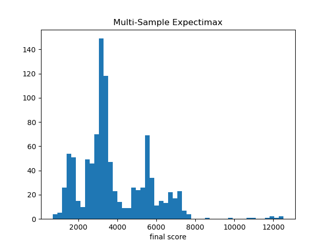

## Analysis of the Game
Game state is the 16 numbers on the 4 x 4 board. 

## Work in Progress

- [x] Deep Q Learning
- [ ] Functional approximator for Q function. 
    - [x] Adding BN to Q model  
    - [x] Add exponential activation at the end, add log prerpocessing at the start.
- [x] Implement CNN version of Q network. 
- [x] Apply Q function to policy. 
- [x] implement A2C from scratch...
- [ ] implement PPO from scratch
- [ ] refactor nn update process
- [ ] try implement multiprocessing on windows... 


## Performance Comparison 
Non-RL, Tree search method (Monte Carlo Expectation maximization) with 2 search step and 4 seeds. Mean score 3823.38+-1776.06. Max score 12524. 



## Lessons Learnt about training RL agent
* Note the loss of different trajectories needs to be mean over not summed... 
* In computing policy gradient, don't pass gradient to value network (?) Compute gradient of value network only w.r.t. value loss. 
* when concatenating trajectories across episodes, note the initial state problem. In a single trajectory, the init
* Note the shape of tensors... squeeze the value output.
* The training diverged at iteration 35, surrogate decayed and was very bad. 
```log
iteration 35 summary 1048.03+-487.84
Run299-opt0 Valuee L2 125621.3 surrogate -7.3 entropy_err 0.3
Run299-opt10 Valuee L2 65059.0 surrogate -287927057776640.0 entropy_err 0.2
Run299-opt20 Valuee L2 53312.6 surrogate -49023297882423296.0 entropy_err 0.2
Run299-opt30 Valuee L2 46918.3 surrogate -20084860508962816.0 entropy_err 0.2
...
Run299 Loss decomp Valuee L2 18290.3 surrogate -22804005126144.0 entropy_err 0.2
100%|██████████| 300/300 [01:43<00:00,  2.89it/s]
iteration 36 summary 786.61+-372.59
```
* Note the gradient tend to explode if the sample size is small.... maybe just too noisy. So it's a good idea not to update untill you collect enough steps to do so. 