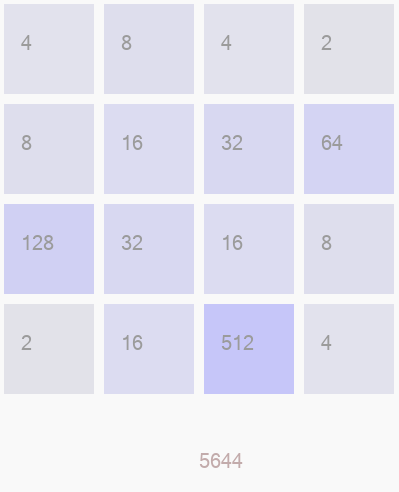
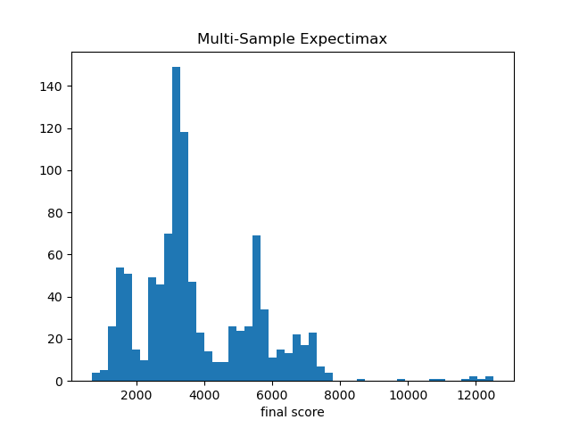
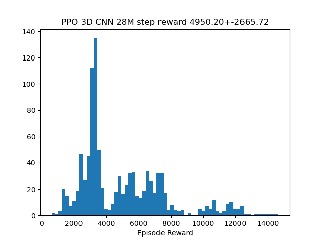
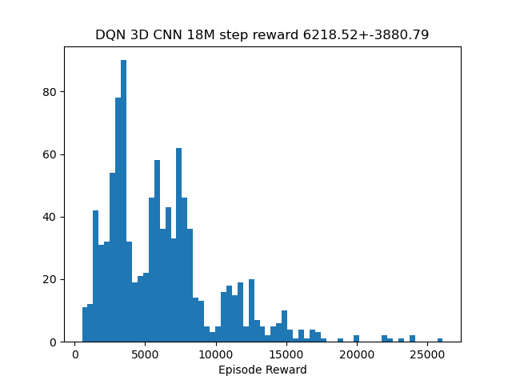
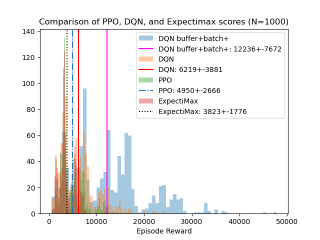

# Training Agents to play 2048 with 3D CNN

## Analysis of the Game
Game state is the 16 numbers on the 4 x 4 board. 


## Work in Progress

- [x] Deep Q Learning
- [x] Functional approximator for Q function. 
    - [x] Adding BN to Q model  
    - [x] Add exponential activation at the end, add log prerpocessing at the start.
- [x] Implement CNN version of Q network. 
- [x] Apply Q function to policy. 
- [x] implement A2C from scratch...
- [ ] implement PPO from scratch
- [ ] ~~refactor nn update process~~
- [ ] ~~try implement multiprocessing on windows...~~ 
- [x] Advanced function approximators building in more invariance across log space.  
  - [x] Implement 3D convolutional network as policy or Q network. --- really helpful.
- [x] Train using Stable Baselines3, PPO
- [x] Train using Stable Baselines3, PPO initalized from behavior cloning agent. 
- [x] Train using Stable Baselines3, DQN


## Performance Comparison 
**Non-RL, Tree search method** (Monte Carlo Expectation maximization) with 2 search step and 4 seeds. Mean score 3823.38+-1776.06. Max score 12524. 



**Behavior cloning** from the dataset collected by tree search method. Mean score 2612.72+-1289.63. As expected, behavior cloning is not as good as expectimax since it has no notion of reward and try to match everything. (not showing)

**RL method**: DQN, PPO. DQN trains faster and reached higher score in our experiment. (reached ~4000 score in 1 hour.) 
* PPO, mean score: 4950.20+-2665.72, Max score: 14660.
* DQN, mean score: 6218.52+-3881.79, Max score: 26104.





Merged comparison plot of DQN, PPO and expectimax. DQN is the winner! 


A Demo video of agent behavior:
[](https://www.youtube.com/watch?v=COQoG1CeGxI)

## Lessons Learnt about training RL agent
* Note the loss of different trajectories needs to be mean over not summed... 
* In computing policy gradient, don't pass gradient to value network (?) Compute gradient of value network only w.r.t. value loss. 
* when concatenating trajectories across episodes, note the initial state problem. In a single trajectory, the init
* Note the shape of tensors... squeeze the value output.
* The training diverged at iteration 35, surrogate decayed and was very bad. 
```log
iteration 35 summary 1048.03+-487.84
Run299-opt0 Valuee L2 125621.3 surrogate -7.3 entropy_err 0.3
Run299-opt10 Valuee L2 65059.0 surrogate -287927057776640.0 entropy_err 0.2
Run299-opt20 Valuee L2 53312.6 surrogate -49023297882423296.0 entropy_err 0.2
Run299-opt30 Valuee L2 46918.3 surrogate -20084860508962816.0 entropy_err 0.2
...
Run299 Loss decomp Valuee L2 18290.3 surrogate -22804005126144.0 entropy_err 0.2
100%|██████████| 300/300 [01:43<00:00,  2.89it/s]
iteration 36 summary 786.61+-372.59
```
* Note the gradient tend to explode if the sample size is small.... maybe just too noisy. So it's a good idea not to update untill you collect enough steps to do so. 
